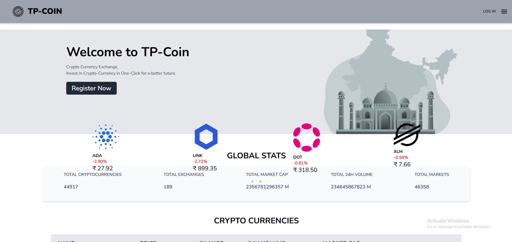
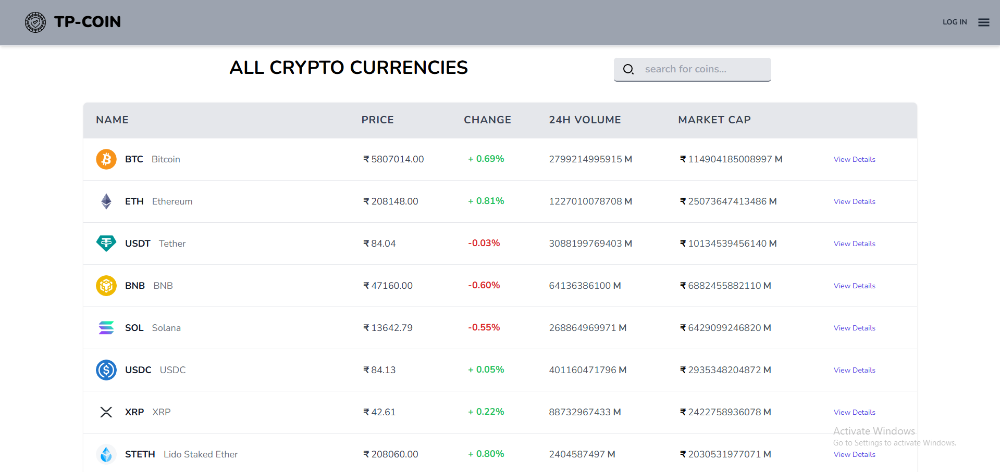
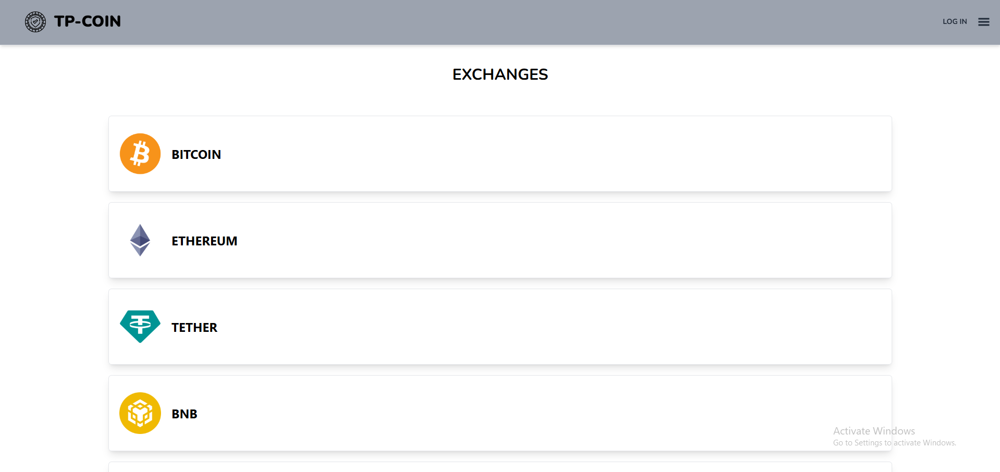
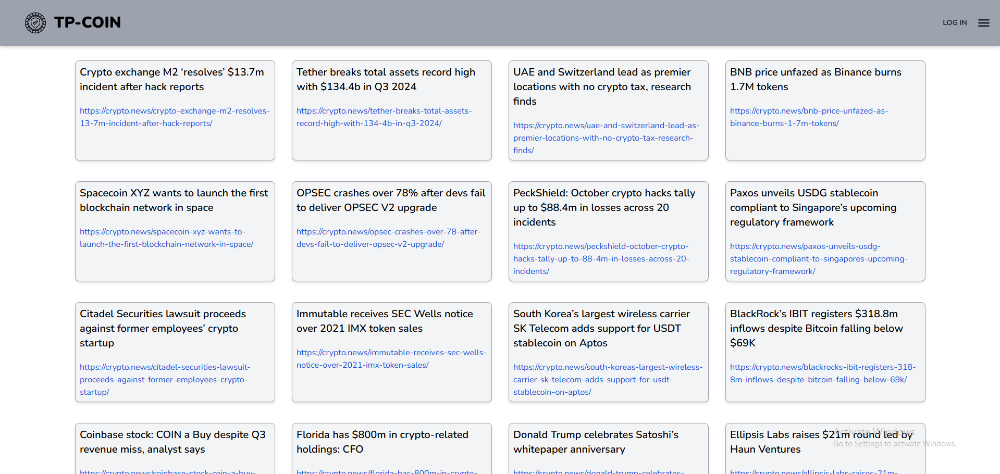
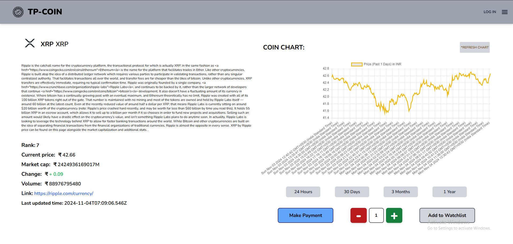
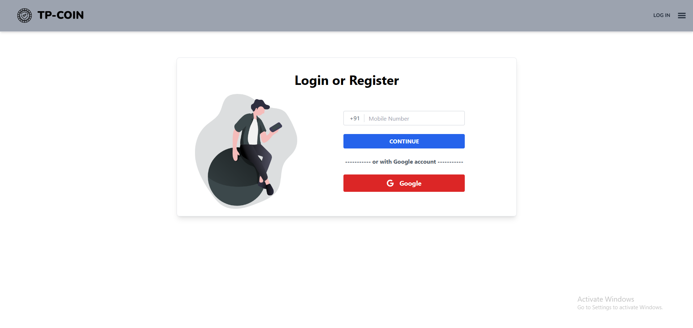
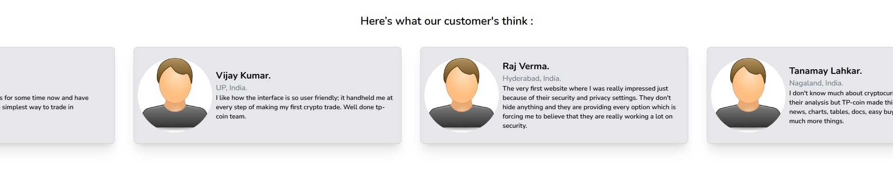
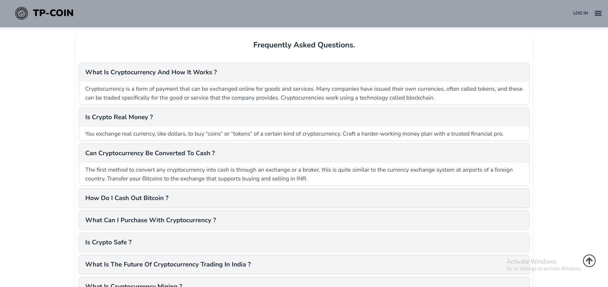

# TP-Coin - Cryptocurrency Exchange Platform

## Project Description

TP-Coin is a cryptocurrency trading platform built on the MERN stack, offering users a secure and user-friendly experience for buying, selling, and managing digital assets. The website provides real-time trading capabilities, allowing users to track their portfolio and execute trades seamlessly. With integrated payment options and authentication mechanisms, TP-Coin ensures secure transactions and data protection, making it an ideal solution for both novice and experienced cryptocurrency traders.

## Table of Contents

- [Features](#features)
- [Technologies Used](#technologies-used)
- [Deployment](#deployment)
- [Installation and Setup](#installation-and-setup)
- [API Documentation](#api-documentation)
- [Contributing](#contributing)
- [Contact Information](#contact-information)

## Features

- **Google OAuth Login:** Quick and secure login using Google account credentials, ensuring seamless access.
- **Mobile OTP Login (Twilio):** Secure mobile authentication with OTP verification through Twilio.
- **Razorpay Payment Integration:** Safe and reliable payment processing for cryptocurrency transactions with Razorpay.
- **Real-Time Coin Search:** Instantly search for any cryptocurrency and view real-time data and updates.
- **Market News & Insights:** Stay informed with the latest news and trends in the cryptocurrency market.
- **Exchange Rates:** Access real-time exchange rates to make well-informed trading decisions.
- **Portfolio Tracking:** Manage and monitor your cryptocurrency holdings with real-time portfolio updates.
- **Secure Transaction Handling:** Conduct secure transactions backed by advanced authentication protocols.
- **Public Reviews:** View user reviews and feedback to gain insights into platform trustworthiness and functionality.
- **Frequently Asked Questions (FAQs):** Find answers to common questions to help navigate the platform.
- **Interactive Dashboard:** Centralized dashboard to view portfolio, recent trades, and market stats.

## Technologies Used

### Frontend

- **React.js** Core library for building interactive user interfaces with a component-based approach.
- **Tailwind CSS** & **DaisyUI** Utility-first CSS framework with DaisyUI for pre-built components, enabling efficient and responsive design.
- **React Router** Provides declarative navigation and routing between pages.
- **Axios** Promise-based HTTP client for making API requests to fetch and manage data.
- **React Toastify** Simplifies adding customizable toast notifications for user feedback.
- **Chart.js & react-chartjs-2** Libraries for creating dynamic and responsive charts to visualize data effectively.
- **React Icons** Provides a variety of icons for use throughout the UI, enhancing visual appeal.
- **UUID** Used for generating unique identifiers, particularly useful in lists and data keys.

### Backend

- **Node.js:** JavaScript runtime for building scalable network applications.
- **Express.js:** Web application framework for Node.js.
- **MongoDB:** NoSQL database for storing product and user data.
- **Mongoose:** ODM (Object Data Modeling) library for MongoDB and Node.js.
- **JSON Web Tokens (JWT):** Authentication mechanism for secure user sessions.
- **Twilio:** Service for mobile OTP authentication.
- **Razorpay:** Payment gateway for processing payments securely.

## Deployment

- **Vercel:** Platform for frontend deployment and hosting.
- **Frontend:** [TP-Coin Frontend](https://tp-coin.vercel.app/)
- **Backend:** [TP-Coin Backend](https://tp-coin-api.vercel.app/)

## Installation and Setup

To set up the TP-Coin project locally, follow these steps:

### Prerequisites

- Node.js (version 14 or later)
- MongoDB (running locally or via a cloud provider)
- A package manager (npm or yarn)

### Backend Setup

1. Clone the repository:

   ```bash
   git clone https://github.com/Pruthviraj-03/tp-coin.git
   ```

2. Navigate to the backend directory:

   ```bash
   cd server
   ```

3. Install dependencies:

   ```bash
   npm install
   ```

4. Create a `.env` file in the backend directory and add the necessary environment variables:

   ```env
   MONGO_URI=<your_mongo_connection_string>
   JWT_SECRET=<your_jwt_secret>
   TWILIO_ACCOUNT_SID=<your_twilio_account_sid>
   TWILIO_AUTH_TOKEN=<your_twilio_auth_token>
   RAZORPAY_KEY_ID=<your_razorpay_key_id>
   RAZORPAY_SECRET_KEY=<your_razorpay_secret_key>
   ```

5. Start the backend server:
   ```bash
   npm run dev
   ```

### Frontend Setup

1. Navigate to the frontend directory:

   ```bash
   cd ../client
   ```

2. Install dependencies:

   ```bash
   npm install
   ```

3. Start the frontend server:
   ```bash
   npm start
   ```

### Access the Application

Open your browser and go to `http://localhost:3000` to view the TP-Coin application.

## API Documentation

The TP-Coin application leverages the CoinGecko API to retrieve and display cryptocurrency data. Below are the main endpoints used in the application:

### Coin API Endpoints

#### Coin List

- **Endpoint:** `GET https://api.coingecko.com/api/v3/coins/markets`
- **Parameters:**
  - `vs_currency` (string): The target currency (e.g., USD) for conversion.
  - `order` (string): Sort order (e.g., `market_cap_desc`).
  - `per_page` (number): Number of coins per page (e.g., 100).
  - `page` (number): Page number for pagination (e.g., 1).
  - `sparkline` (boolean): If true, includes sparkline data.
- **Description:** Fetches a list of top coins based on market capitalization in the specified currency.

#### Single Coin

- **Endpoint:** `GET https://api.coingecko.com/api/v3/coins/{id}`
- **Parameters:**
  - `id` (string): The unique identifier of the coin (e.g., `bitcoin`).
- **Description:** Returns detailed information about a specific coin, including market data, historical data, and metadata.

#### Historical Chart

- **Endpoint:** `GET https://api.coingecko.com/api/v3/coins/{id}/market_chart`
- **Parameters:**
  - `id` (string): The unique identifier of the coin.
  - `vs_currency` (string): The currency for conversion (e.g., USD).
  - `days` (number): The number of days for historical data (default is 365).
- **Description:** Retrieves historical market data for a specific coin, including prices over a specified time period.

#### Trending Coins

- **Endpoint:** `GET https://api.coingecko.com/api/v3/coins/markets`
- **Parameters:**
  - `vs_currency` (string): The target currency (e.g., USD) for conversion.
  - `order` (string): Sort order (e.g., `gecko_desc`).
  - `per_page` (number): Number of trending coins (e.g., 10).
  - `page` (number): Page number for pagination (e.g., 1).
  - `sparkline` (boolean): If true, includes sparkline data.
  - `price_change_percentage` (string): Period for price change percentage (e.g., `24h`).
- **Description:** Fetches a list of trending coins based on popularity and recent market performance.

### Additional Features

- **Coin Search:** Allows users to search for specific coins by name or symbol.
- **News and Updates:** Fetches the latest news related to cryptocurrencies.
- **Exchange Rates:** Displays current exchange rates for selected coins.
- **Frequently Asked Questions (FAQ):** Provides answers to common questions about cryptocurrencies and trading.
- **Public Reviews:** Displays user reviews and feedback on popular coins.

Each of these endpoints is utilized to provide real-time data on cryptocurrencies, enabling users to monitor market trends, track portfolios, and stay informed.

## Screenshots

Here are some screenshots of the TP-Coin website for reference:

- **Home Page**  
  

- **All Coins Page**  
  

- **Exchanges Page**  
  

- **News Page**  
  

- **Coin Page**  
  

- **Login Page**  
  

- **Footer Section**  
  

- **Shopping Cart Page**  
  

- **Reviews Page**  
  

- **Query's Page**  
  

## Contributing

We welcome contributions to the TP-Coin project! If you're interested in helping us improve the application, please follow these steps:

1. **Fork the Repository:** Click the "Fork" button in the top right corner of the repository page to create your own copy.
2. **Clone the Forked Repository:**

   ```bash
   git clone https://github.com/your-username/tp-coin.git
   ```

   Replace `your-username` with your GitHub username.

3. **Create a New Branch:**

   ```bash
   git checkout -b feature/your-feature-name
   ```

   Replace `your-feature-name` with a descriptive name for your feature or fix.

4. **Make Your Changes:** Implement your feature or bug fix in the codebase.

5. **Commit Your Changes:**

   ```bash
   git add .
   git commit -m "Add your commit message"
   ```

6. **Push to Your Forked Repository:**

   ```bash
   git push origin feature/your-feature-name
   ```

7. **Create a Pull Request:** Go to the original repository and click on "New Pull Request." Provide a description of your changes and submit the pull request for review.

### Guidelines

- Ensure your code adheres to the project's coding standards and style.
- Write clear commit messages that describe the changes made.
- If your changes include new features, consider adding documentation or examples as needed.

Thank you for your interest in contributing to TP-Coin!

## Contact Information

For any inquiries or feedback, you can reach me through the following channels:

- **Portfolio:** [Pruthviraj Kurane's Portfolio](https://pruthviraj-kurane.netlify.app/)
- **Email:** pruthvirajkurane03@gmail.com

Feel free to connect with me for collaboration, suggestions, or questions regarding the TP-Coin project!
